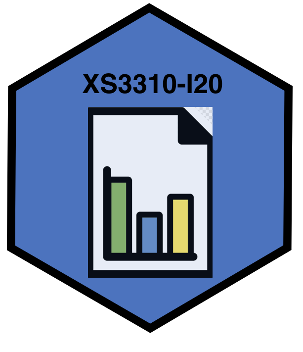

<figure>
  
</figure>

La información del curso está en Mediación Virtual, este repositorio es para el material de clase.

[Programa del curso](http://www.estadistica.ucr.ac.cr/images/EEST/Programas/Bachi/2020/I_Ciclo/Programa-XS-3310.pdf)

<table style="width:100%">
  <tr>
    <th> Fecha </th>
    <th> Clase </th>
    <th> Tareas </th>
  </tr>
  <tr>
    <td> 10 de marzo </td>
    <td>  <a href="XS3310-I20_1.html">Clase 1</a> </td> 
    <td> Llenar cuestionario, Slack, Mediación Virtual </td>
  </tr>
  <tr>
    <td> 13 de marzo </td>
    <td>  <a href="XS3310-I20_2.html">Clase 2</a> </td> 
    <td> Práctica: 8.1 - 8.20 de Mendenhall </td>
  </tr>
    <tr>
    <td> 17 de marzo </td>
    <td>  <a href="XS3310-I20_3.html">Clase 3</a> </td> 
    <td> Práctica </td>
  </tr>
      <tr>
    <td> 20 de marzo </td>
    <td>  <a href="XS3310-I20_4.html">Clase 4</a> </td> 
    <td> Práctica </td>
  </tr>
</table>

