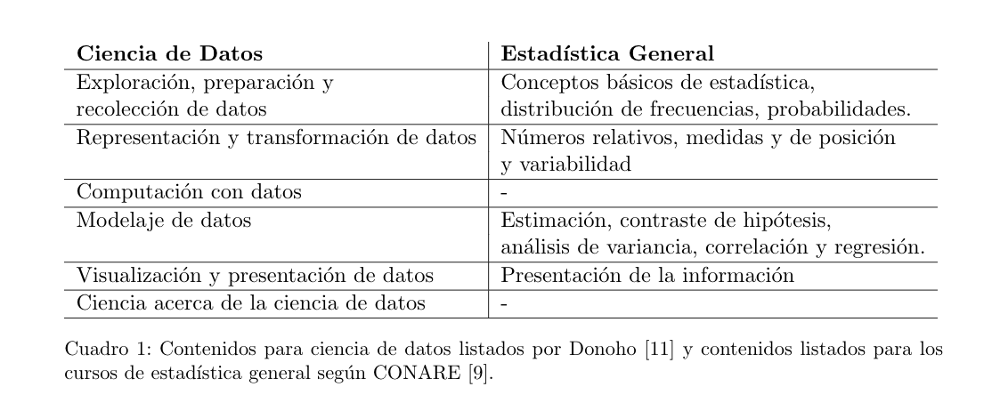

```{r setup, include=FALSE}
options(htmltools.dir.version = FALSE)
```

## Bienvenida

### Alejandro Salas Vargas

* Licenciado en la Enseñanaza de la Matemática
* MSc en Estadística
* Profesor en UNED y UCR

### Áreas de interés

* Matemática y su enseñanaza
* Estadística Bayesiana
* Análisis de Datos Funcionales
* Teoría Estadística
* Ciencia de Datos

---
## Bienvenida

### Maikol Solís

* Profesor Asociado, Escuela de Matemática 
* Bach. Ciencias Actuariales. 
* Msc. en Matemática Aplicada, Université Paul Sabatier. 
* Msc. en Matemática Aplicada, Universidad de Costa Rica.
* Ph.D en Estadística, Université Paul Sabatier. 

### Áreas de interés

Mi trabajo reciente se enfoca en el análisis de sensibilidad en modelos estadísticos a través de distintos métodos: 
* Estadística no paramétrica,
* Teoría topológica y geometría,
* Usando "relative weight analysis". 

Además, como parte de una colaboración interdisciplinaria, estoy colaborando en proyecto para la generación de estrategias de muestreo masivo para la detección de enfermedades virales (SARS-COV2). 

---

## Bienvenida
### Acerca de ustedes

* Compartan su nombre, año de carrera y algo que le gustaría compartir


---

## Información importante

### Programa del curso

### Por hacer

---

class: center, middle

## Hasta ahora en la carrera de Estadística:

En medio del auge de ciencia de datos, datos grandes, y tantas puertas que la tecnología nos ha abierto.



### ¿Para qué necesitamos Teoría Estadística?

---

class: center, middle

# Hasta ahora en la carrera de Estadística:

 ¿Qué vimos en modelos probabilísticos discretos y contínuos? 

## https://seeing-theory.brown.edu


---

## Repaso de Inferencia Estadística

### -Variable aleatoria (v.a.)

### - Muestra aleatoria (m.a.)

### - Parámetro

### - Estadístico

### - Estimador 


---


## Parámetros, estadísticos y estimadores
	
### Variable aleatoria (v.a.)	

Una variable aleatoria (v.a.) ${\displaystyle X}$ es una función real definida en el espacio de probabilidad ${\displaystyle (\Omega ,{\mathcal {A}},P)}$, asociado a un experimento aleatorio.

> ${\displaystyle X:\Omega \to \mathbb {R} }$

### Muestra aleatoria (m.a.)

Sean $X_{1}, X_{2}, ... , X_{n}$ un conjunto de variables aleatorias (v.a.) independientes e idénticamente distribuidas; este conjunto se denomina *muestra aleatoria* de una población infinita.

---

## Parámetros, estadísticos y estimadores

### Parámetro

Es una característica de la población. Algunos parámetros de interés podría ser la media, varianza o la proporción en una población.

### Estadístico

Es una función de la muestra aleatoria, $T=f\left(X_{1}, X_{2}, ... , X_{n}\right)$. Un estadístico es a su vez una variable aleatoria y como tal tiene su propia distribución, denominada distribución muestral, con sus parámetros correspondientes.

---

## Parámetros, estadísticos y estimadores

### Estimador

Cuando un estadístico, llámese $\hat{\theta}$, se utiliza para aproximar el valor de un parámetro $\theta$, entonces se acostumbra llamar a ese estadístico con el nombre de estimador.

> **Notación:** $\theta$ parámetro a estimar.

> $\hat{\theta}$ estimador de $\theta$.

### Ejemplo:

* $\bar{X}$ es un estimador de $\mu$
* $S^2$ es un estimador de $\sigma^2$
* $\hat{p}$ es un estimador de $p$
* $\hat{\theta}=\frac{X_1+X_n}{2}$ es un estimador de $\mu$

---

## Parámetros, estadísticos y estimadores
	
### Ejemplo:

1. Media muestral: $\bar{X} =\frac{\sum_{i=1}^n{ {X}_i } }{n}$

Se sabe que $\displaystyle E\left(\bar{X}\right)=\mu$ y $\displaystyle Var\left(\bar{X}\right)=\frac{\sigma^2}{n}$, donde $\mu$ y $\sigma^2$ son la media y variancia poblacional. 

La distribución de $\bar{X}$ va a depender de la distribución de la población. No obstante, con muestras grandes podemos hacer uso del Teorema del Límite Central, el cual dice:

$$Z_{n} = \frac{\bar{X}-\mu}{\frac{\sigma}{\sqrt{n}}} \xrightarrow{\text{d}} N\left(0,1\right) \quad si\quad n \rightarrow \infty$$

O lo que es equivalente a decir que $\bar{X} \xrightarrow{\text{d}} N\left(\mu, \frac{\sigma^2}{n}\right) \quad si\quad n \rightarrow \infty$.

---

## Parámetros, estadísticos y estimadores
	
### Ejemplo:

1. Variancia muestral: $S^{2} = \frac{\sum{\left(X_{j}-\bar{X}\right)^2}}{n-1}$

Podemos demostrar que $E\left(S^2\right)=\sigma^2$ y $Var\left(S^2\right)=\frac{2\sigma^4}{n-1}$.

### Prueba: 

En la sección siguiente, probaremos que si la población es $N\left(\mu,\sigma^2\right)$, entonces, $$\displaystyle \frac{\left(n-1\right)S^2}{\sigma^2} \sim \chi^{2}_\left(n-1\right)$$. 
Además sabemos que el valor esperado de una ji-cuadrado son sus grados de libertad y la varianza son dos veces los grados de libertad. Por lo tanto,

$$ E\left(\frac{\left(n-1\right)S^2}{\sigma^2}\right) = n-1  \\
    \Rightarrow \frac{\left(n-1\right)E\left(S^2\right)}{\sigma^2} = n-1 \\
	  \Rightarrow E\left(S^2\right) = \sigma^2 $$

---

## Parámetros, estadísticos y estimadores
	

Podemos hacer lo mismo para encontrar la varianza cuando la población es Normal:

$$  Var\left(\frac{\left(n-1\right)S^2}{\sigma^2}\right) = 2\left(n-1\right) $$ 

$$ \Rightarrow \frac{\left(n-1\right)^2}{\sigma^4}Var\left(S^2\right) = 2\left(n-1\right) \\
\Rightarrow Var\left(S^2\right) = \frac{2\sigma^4}{n-1} $$
---
## Parámetros, estadísticos y estimadores

En realidad la distribución ji-cuadrada es la distribución muestral de $S^2$. O sea que si se extraen todas las muestras posibles de una población normal y a cada muestra se le calcula su varianza, se obtendrá la distribución muestral de varianzas.

Para estimar la varianza poblacional o la desviación estándar, se necesita conocer el estadístico $X^2$. Si se elige una muestra de tamaño $n$ de una población normal con varianza $\sigma^2$, el estadístico:

$$X^2= \displaystyle \frac{(n-1)S^2}{\sigma^2}$$

tiene una distribución muestral que es una distribución ji-cuadrada con $gl= n-1$ grados de libertad, es decir, $$\displaystyle \frac{\left(n-1\right)S^2}{\sigma^2} \sim \chi^{2}_\left(n-1\right)$$. 