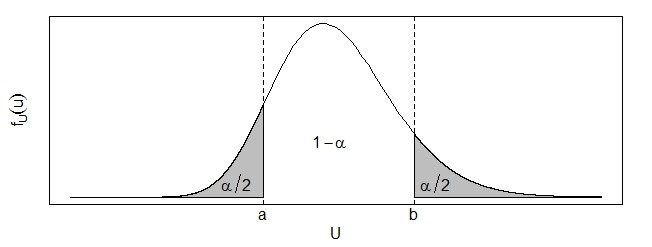
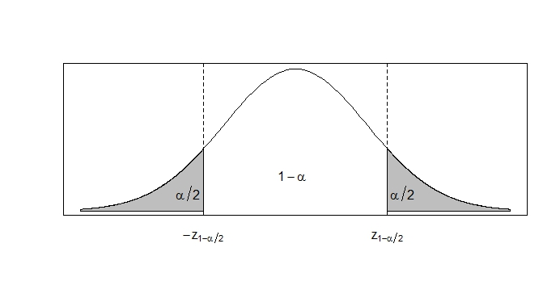
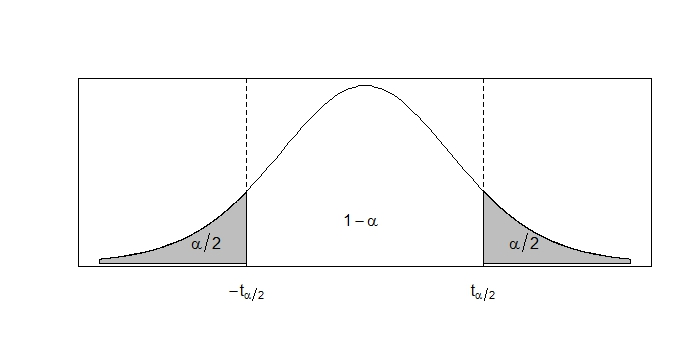

```{r setup, include=FALSE}
knitr::opts_chunk$set(echo = TRUE)
```

class: center, middle

# ¿Qué hemos visto hasta ahora?

Todo sobre estimadores puntuales + intro a los pivotes.

# ¿Qué vamos a discutir hoy?

Intervalos de confianza clásicos.


---

# Estimación por Intervalo

* Una estimación por intervalo para un parámetro desconocido $\theta$ viene dada por un rango o intervalo que posee cierta confianza $(1-\alpha)\%$ de contener a dicho parámetro.

* Usualmente este concepto de *confianza* se interpreta diciendo que si obtenemos 100 intervalos entonces $\alpha \%$ de ellos no van a incluir el valor del parámetro. Es decir, si tenemos 100 intervalos del $95\%$ de confianza entonces se espera que 5 de ellos no incluyan el valor del parámetro, o que de 20 intervalos haya uno que no lo incluya.


Visualmente:
https://seeing-theory.brown.edu/frequentist-inference/es.html

---

### Técnica del pivote

**En la clase pasada:**

Ejemplo: Sea $X$ una variable aleatoria Uniformemente distribuida en el intervalo $(0, \theta)$, con $\theta$ desconocido. Determine un intervalo de confianza unilateral inferior para $\theta$ del $95\%$.

Llegaron a la conclusión:

Por lo tanto podemos concluir que con un $95\%$ de confianza el intervalo $\left[ \frac{X}{0.95}, +\infty \right[$ incluye el valor de $\theta$. 


Ejemplo: Suponiendo que $\theta = 50$ simule un valor que pertenece a la población del ejemplo anterior y evalueelo en el intervalo encontrado. 
	
Solución: Recordemos que para simular debemos igualar la función de distribución de la variable aleatoria objetivo con la de una Uniforme $(0,1)$. En nuestro caso tenemos la siguiente función de distribución para $X$:
	
$F_{X}(x)=\begin{cases}0\quad si \quad x \leq 0 \\ \frac{x}{\theta} \quad si \quad 0 < x < \theta \\ 1 \quad si \quad x > \theta \end{cases}$

	
---

### Técnica del pivote

Por lo tanto para simular un valor de esta distribución debemos hacer lo siguiente:
	
$U = \frac{X}{\theta}$
	
$\Rightarrow X = \theta U$
	
Usando la función para valores aleatorios entre cero y uno de una calculadora obtuvimos que $u = 0.821$, por lo tanto el valor simulado sería $x = 41.05$, con $\theta = 50$. 

Evaluando este valor en el intervalo obtenido tenemos que con un $95\%$ de confianza el intervalo $\left[ 43.21, +\infty \right[$ incluye el valor de $\theta$. Podemos ver que en este caso nuestro intervalo acertó el verdadero valor de $\theta$. 
	
NOTA: Es posible observar que si $u > 0.95$ entonces el intervalo no va a incluir el valor de $\theta = 50$, para una confianza del $95\%$. 
	
---

### Técnica del pivote

	
Ejemplo: Sea $X_{1}, X_{2}, ... , X_{20}$ una muestra aleatoria tal que $X_{j} \sim Exp(\beta)$. Determine un intervalo de confianza bilateral para $\beta$ con una confianza del $(1-\alpha)\%$. Utilice como pivote una función de $\sum_{j=1}^{20} X_{j}$. 

Solución: Sabemos de antemano que $T = \sum_{j=1}^{20} X_{j} \sim Gamma(\alpha = 20,\beta)$. 
	
$T$ no sirve como pivote pues no depende de $\beta$ y su distribución todavía depende de $\beta$. Debemos encontrar alguna transformación de $T$ que haga que se cumplan las dos condiciones.
	
Recordemos que la función generadora de momentos de una Gamma $(\alpha,\beta)$ es $(1-\beta t)^{-\alpha}$. Por lo tanto, si $U = \frac{T}{\beta}$ entonces,
	
$m_{U}(t) = m_{T}\left(\frac{t}{\beta}\right) = \left(1-t\right)^{-20}$
	
---

### Técnica del pivote

	
Esto quiere decir que $U \sim Gamma(20,1)$ y por lo tanto se puede emplear como un pivote pues cumple las dos condiciones. Ahora procedemos a encontrar los valores $a$ y $b$ tales que $P(U < a) = P(U > b) = \frac{\alpha}{2}$. Como la Gamma no tiene una función de distribución en forma cerrada debemos proceder a integrar la función de densidad:
	
$P(U < a) = \int_{0}^{a} \frac{u^{19}e^{-u}}{\Gamma(20)} du = \frac{\alpha}{2}$

---

### Técnica del pivote


Esta integral es posible de calular a mano, pero su desarrollo necesita de 19 por partes que hacen su cálculo extremadamente largo y tedioso. Sin embargo, podemos hacer uso de tablas estadísticas que nos dan cuartiles para ciertas probabilidades. En este caso no tenemos una tabla para una Gamma con estos parámetros, pero sí tenemos para otra Gamma: la ji-cuadrado. Afortunadamente existe una forma para pasar de cualquier Gamma a una $\chi^2$: 
	
Sea $V = \frac{2T}{\beta}$ entonces,
	
$m_{V}(t) = m_{T}\left(\frac{2t}{\beta}\right) = \left(1-2t\right)^{-20} = \left(1-2t\right)^{-\frac{40}{2}}$
	
Esta es la función generadora de momentos de una ji-cuadrado con 40 grados de libertad, de la cuál sí tenemos tablas para encontrar cuantiles. Ahora si podemos proceder a encontrar los valores de $a$ y $b$, sabiendo que gráficamente lucen de la siguiente manera: 
	
---

### Técnica del pivote

	


---

### Técnica del pivote


Como la tabla de la ji-cuadrado acumula hacia la derecha (a más de), esto significa que $a$ es el valor de la tabla de una ji-cuadrado con $40$gl que acumula a su derecha una probabilidad de $1-\frac{\alpha}{2}$. Por consiguiente $b$ es el valor de la tabla que acumula a su derecha una probabilidad de $\frac{\alpha}{2}$. Para simiplicidad vamos a llamar estos valores $\chi^{2}_{1-\frac{\alpha}{2}, 40}$ y $\chi^{2}_{\frac{\alpha}{2}, 40}$, respectivamente. 
	
Ya encontrados los valores de $a$ y $b$ podemos proceder a despejar $\beta$ de la probabilidad que acumula $1-\alpha$:
	
$P(a \leq V \leq b) = P\left( \chi^{2}_{1-\frac{\alpha}{2}, 40} \leq \frac{2T}{\beta} \leq \chi^{2}_{\frac{\alpha}{2}, 40} \right) =  P\left(  \frac{2T}{\chi^{2}_{\frac{\alpha}{2}, 40}} \leq \beta \leq \frac{2T}{\chi^{2}_{1-\frac{\alpha}{2}, 40}}  \right) = 1 -\alpha$
	
Por lo tanto, con una confianza de $(1-\alpha)\%$ el intervalo $\left[ \frac{2\sum_{j=1}^{20} X_{j}}{\chi^{2}_{\frac{\alpha}{2}, 40}}, \frac{2\sum_{j=1}^{20} X_{j}}{\chi^{2}_{1-\frac{\alpha}{2}, 40}}  \right]$ incluye el valor de $\beta$. 

---
class: justify
## Intervalos de confianza para poblaciones normales
	
### Intervalos de confianza para $\mu$
	
Sea $X_{1}, X_{2}, ... , X_{n}$ una muestra aleatoria de una población Normal con media $\mu$ y variancia $\sigma^2$, donde $\mu$ es desconocido pero $\sigma^2$ es conocido. Vamos a construir un intervalo de confianza bilateral para $\mu$ con probabilidad $1-\alpha$. 
	
Primero debemos encontrar un pivote que dependa de la muestra y de $\mu$ en su forma de cálculo pero cuya distribución no dependa de $\mu$. Como habiamos visto en un ejemplo anterior podemos utilizar como pivote a $Z = \frac{\overline{X} - \mu}{\frac{\sigma}{\sqrt{n}}}$, ya que $Z \sim N(0,1)$. Luego procedemos a encontrar los valroes $a$ y $b$ que satisfacen $P(a \leq Z \leq b) = 1-\alpha$ y $P(Z < a) = P(Z > b) = \frac{\alpha}{2}$. 

Como no conocemos una expresión cerrada para la función de distribución de una Normal Estándar, procedemos a utilizar las tablas. Estas tablas acumulan hacia la izquierda (a menos de), por lo que $a$ es el valor de la tabla que acumula a su izquierda una probabilidad de $\frac{\alpha}{2}$, mientras que $b$ es el valor de la tabla que acumula a su izquierda $1 - \frac{\alpha}{2}$. Por simplicidad llamaremos a estos valores $z_{\frac{\alpha}{2}}$ y $z_{1-\frac{\alpha}{2}}$, respectivamente. 

---

## Intervalos de confianza para $\mu$

Sin embargo, sabemos que la distribución Normal Estándar es simétrica alrededor de cero, por lo que $z_{\frac{\alpha}{2}} = -z_{1-\frac{\alpha}{2}}$. Por lo tanto tenemos que, $a = -z_{1-\frac{\alpha}{2}} \qquad b = z_{1-\frac{\alpha}{2}}$
	

---

## Intervalos de confianza para $\mu$


Con estos valores podemos proceder a despejar $\mu$ de la expresión $P(a \leq Z \leq b) = 1-\alpha$: 
	
$P(a \leq Z \leq b) = P\left(-z_{1-\frac{\alpha}{2}} \leq \frac{\overline{X} - \mu}{\frac{\sigma}{\sqrt{n}}} \leq z_{1-\frac{\alpha}{2}} \right)$


$= P\left( \overline{X} - z_{1-\frac{\alpha}{2}} \frac{\sigma}{\sqrt{n}} \leq \mu \leq \overline{X} + z_{1-\frac{\alpha}{2}} \frac{\sigma}{\sqrt{n}} \right) = 1-\alpha$
		
Por lo tanto, con confianza del $(1-\alpha)\%$, el intervalo $\overline{X} \pm z_{1-\frac{\alpha}{2}} \frac{\sigma}{\sqrt{n}}$ contiene al valor de $\mu$. 

---

## Intervalos de confianza para $\mu$
	
¿Qué sucede si $\sigma^2$ es desconocido? 
	
Si esto pasa no podemos hacer uso del mismo pivote pues no cumple la primera condición de ser un pivote. Recordemos que esta condición nos pide que el pivote esté en términos de la muestra y el parámetro desconocido, pero además no puede estar en términos de otro parámetro desconocido. Hasta el momento todos los otros parámetros que no eran en el de interés eran conocidos, pero ahora $\sigma^2$, que formaba parte del pivote, ya no es conocido. Por lo tanto, debemos hacer uso de un nuevo pivote. 
	
En este caso podemos usar la siguiente variable aleatoria: 
	
$T = \frac{\overline{X} - \mu}{\frac{s}{\sqrt{n}}}$
	
Recordemos que esta variable aleatoria se distribuye como una t-student con $n-1$ grados de libertad. Nótese que esta variable aleatoria sí cumple todas las condiciones de un pivote pues está en términos de la muestra aleatoria (a través de $\overline{X}$ y $S$) y del parámetro desconocido $\mu$ y ya no depende del parámetro desconocido $\sigma^2$. Adicionalmente su distribución es conocida y no depende de $\mu$. Ahora procedemos a encontrar los valores de $a$ y $b$. 

---

## Intervalos de confianza para $\mu$


Las tablas de la t-student que utilizamos acumulan hacia la derecha, por lo que $a$ es el valor de la tabla con $n-1$ grados de libertad que acumula a su derecha una probabilidad de $1-\frac{\alpha}{2}$ y por lo tanto $b$ es el valor de la misma tabla que acumula a su derecha $\frac{\alpha}{2}$. Por simplicidad llamaremos a estos valores $t_{1-\frac{\alpha}{2}, n-1}$ y $t_{\frac{\alpha}{2}, n-1}$, respectivamente. Nuevamente, podemos hacer uso de la simetría alrededor de cero que tiene la t-student. Por lo tanto, 
	
$a = -t_{\frac{\alpha}{2}, n-1} \qquad b = t_{\frac{\alpha}{2}, n-1}$

---

## Intervalos de confianza para $\mu$


	
Si despejamos el valor de $\mu$ de $P(a \leq T \leq b) = 1-\alpha$, obtenemos el intervalo $\overline{X} \pm t_{\frac{\alpha}{2}, n-1} \frac{s}{\sqrt{n}}$. Por lo tanto podemos concluir que con una confianza del $(1-\alpha)\%$ el intervalo $\overline{X} \pm t_{\frac{\alpha}{2}, n-1} \frac{s}{\sqrt{n}}$ contiene el verdadero valor de $\mu$. 

---

## Intervalos de confianza para $\mu_{1} - \mu_{2}$
	
Ahora supongamos que tenemos dos poblaciones Normales e independientes y que obtenemos una muestra de cada una. Sean $X_{1}, X_{2}, ... , X_{n}$ y $Y_{1}, Y_{2}, ... , Y_{m}$ estas dos muestras aleatorias, tal que $X_{j} \sim N(\mu_{1}, \sigma^{2}_{1})$ y $Y_{i} \sim N(\mu_{2}, \sigma^{2}_{2})$, donde $\mu_{1}$ y $\mu_2$ son parámetros desconocidos y $\sigma^{2}_{1}$ y $\sigma^{2}_{2}$ son parámetros conocidos. Nos interesa construir un intervalo bilateral, con una confianza del $(1-\alpha)\%$, para $\mu_{1} - \mu_{2}$.
	
Igual que siempre, nuesto primer paso es obtener una cantidad pivote. Ya conocemos como se distribuyen los promedios muestrales, por lo que podemos partir de ahí. Recordemos que $\overline{X} \sim N(\mu_{1}, \frac{\sigma^{2}_{1}}{n})$ y $\overline{Y} \sim N(\mu_{2}, \frac{\sigma^{2}_{2}}{m})$. Como ambos son Normales entonces una combinación lineal de ellos también sería Normal; necesitamos una combinación lineal de estos dos que tenga como parámetro a $\mu_{1} - \mu_{2}$. 

---

## Intervalos de confianza para $\mu_{1} - \mu_{2}$


Esto lo podemos lograr utilizando $\overline{X} - \overline{Y}$, la cual se distribuye Normal con media $\mu_{1} - \mu_{2}$ y variancia $\frac{\sigma^{2}_{1}}{n} + \frac{\sigma^{2}_{2}}{m}$. Dado que esta variancia es conocida podemos usar como pivote una Normal Estandár, la cual tendría la siguiente forma:
	
$Z = \frac{(\overline{X} - \overline{Y}) - (\mu_{1} - \mu_{2})}{\sqrt{\frac{\sigma^{2}_{1}}{n} + \frac{\sigma^{2}_{2}}{m}}}$
	
Ya con esto podemos proceder como habiamos hecho en el primer caso de esta sección. De esta manera volveriamos a obtener que $a = -z_{1-\frac{\alpha}{2}}$ y $b = z_{1-\frac{\alpha}{2}}$. Ahora procedemos a despejar nuestro parámetro de interés, $\mu_{1} - \mu_{2}$, de la expresión $P(a \leq Z \leq b) = 1-\alpha$. Después de hacer el despeje podemos ver que con una confianza del $(1-\alpha)\%$, el intervalo $(\overline{X} - \overline{Y}) \pm z_{1-\frac{\alpha}{2}} \sqrt{\frac{\sigma^{2}_{1}}{n} + \frac{\sigma^{2}_{2}}{m}}$ incluye el verdadero valor de $\mu_{1} - \mu_{2}$. 
	

---

## Intervalos de confianza para $\mu_{1} - \mu_{2}$
	
	
Si fuese el caso donde las variancias poblaciones son conocidas (*i.e.* $\sigma^{2}_{1} = \sigma^{2}_{2} = \sigma^{2}$) Entonces podriamos escribir el intervalo como: 
	
$(\overline{X} - \overline{Y}) \pm z_{1-\frac{\alpha}{2}} \cdot \sigma \sqrt{\frac{1}{n} + \frac{1}{m}}$
	

---

## Intervalos de confianza para $\mu_{1} - \mu_{2}$
	
	
Nuevamente podemos postular la interrogante: ¿qué sucede si se desconocen las variancias poblaciones? 
	
En este caso vamos a hacer el supuesto de que $\sigma^{2}_{1} = \sigma^{2}_{2} = \sigma^{2}$ (homoscedasticidad) para poder encontrar un pivote satisfactorio. Podemos intentar volver a utilizar una t-student para solventar el problema de las variancias desconocidas. Recordemos que para una variable aleatoria $T$, esta se distribuye t-student si 
	
$T = \frac{Z}{\sqrt{\frac{W}{v}}}$
	
donde $Z \sim N(0,1)$ y $W \sim \chi^{2}(v)$. Para este caso podemos usar la misma $Z$ que usamos anteriormente:
	
$Z = \frac{(\overline{X} - \overline{Y}) - (\mu_{1} - \mu_{2})}{\sigma \sqrt{\frac{1}{n} + \frac{1}{m}}}$

---

## Intervalos de confianza para $\mu_{1} - \mu_{2}$
	
	
Ahora debemos construir una $\chi^2$ adecuada que nos permita cancelar el $\sigma$ que se encuentra en $Z$. Sabemos lo siguiente:
	
$\frac{(n-1)S^{2}_1}{\sigma^{2}} \sim \chi^{2}(n-1) \qquad \frac{(m-1)S^{2}_2}{\sigma^{2}} \sim \chi^{2}(m-1)$
	
donde $S^{2}_1$ y $S^{2}_2$ son las variancias muestrales de la primera y segunda población, respectivamente. También sabemos que la suma de ji-cuadrado es una ji-cuadrado con la suma de los grados de libertad:
	
$W = \frac{(n-1)S^{2}_{1} + (m-1)S^{2}_{2} }{\sigma^{2}} \sim \chi^{2}(n+m-2)$

---

## Intervalos de confianza para $\mu_{1} - \mu_{2}$
	
		
Si procedemos a dividir esta ji-cuadrado entre sus grados de libertad obtenemos:
	
$\frac{W}{v} = \frac{(n-1)S^{2}_{1} + (m-1)S^{2}_{2} }{\sigma^{2}(n+m-2)}$
	
Para simplificar un poco esta expresión vamos a definir $S^{2}_{p} = \frac{(n-1)S^{2}_{1} + (m-1)S^{2}_{2}}{(n+m-2)}$, por lo tanto
	
$\frac{W}{v} = \frac{S^{2}_{p}}{\sigma^{2}}$
	
Ya con esto podemos montar una t-student, la cual tendría la forma:
	
$T = \frac{(\overline{X} - \overline{Y}) - (\mu_{1} - \mu_{2})}{S_{p} \sqrt{\frac{1}{n} + \frac{1}{m}}}$

---

## Intervalos de confianza para $\mu_{1} - \mu_{2}$
	
Esta es una t-student con $n+m-2$ grados de libertad y la podemos usar como pivote pues cumple todas las condiciones y ya no está en términos de parámetros desconocidos. El procedimiento a seguir es similar al otro caso donde teniamos una t-student y luego de desarrollarlo obtenemos el intervalo 
	
$(\overline{X} - \overline{Y}) \pm t_{\frac{\alpha}{2}, n+m-2} \cdot S_{p} \sqrt{\frac{1}{n} + \frac{1}{m}}$ 
	
Concluimos que con una confianza del $(1-\alpha)\%$ el intervalo $(\overline{X} - \overline{Y}) \pm t_{\frac{\alpha}{2}, n+m-2} \cdot S_{p} \sqrt{\frac{1}{n} + \frac{1}{m}}$ contiene el verdadero valor de $\mu_{1} - \mu_{2}$. 

---
class: center, middle

# ¿Qué discutimos hoy?

Estimación por intervalos, método del pivote. Fórmulas para las estimaciones por intervalo más comunes (media, diferencias de medias para distribuciones normales), 

# ¿Qué nos falta para el II Parcial?

Intervalos de confianza para variancias, para muestras grandes

Bootstrap y contrastes de hipótesis.


